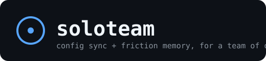

<p align="center">
  
</p>

# soloteam-cli — One Team. One You.

[](https://github.com/ojspace/soloteam-cli/actions/workflows/ci.yml)
[](LICENSE)
[](https://bun.sh)

soloteam-cli keeps a solo developer's Claude Code config (`CLAUDE.md`, `rules/`, `context/`, `commands/`) in sync across every machine they use it from, and nudges them to save a session to memory when it was actually worth remembering.

It is a clean-room reimplementation of the two ideas from [Tencent's teamai-cli](https://github.com/Tencent/teamai-cli) that still make sense once "team" shrinks to one person: direct git sync (no merge-request review needed) and friction-scored session detection (pointed at your own memory instead of a shared knowledge base).

## Table of contents

- [Why soloteam-cli exists](#why-soloteam-cli-exists)
- [Quick start](#quick-start)
- [How it works](#how-it-works)
- [Configuration](#configuration)
- [Commands](#commands)
- [The friction detector](#the-friction-detector)
- [soloteam-cli vs teamai-cli](#soloteam-cli-vs-teamai-cli)
- [Troubleshooting](#troubleshooting)
- [Development](#development)
- [License](#license)

## Why soloteam-cli exists

Claude Code (and Codex, OpenCode, Cursor, ...) all read their rules/skills/context from local files. That's fine on one machine. It stops being fine the moment you also run agents on a second machine — a laptop and a VPS, say — and now have two copies of `CLAUDE.md` that quietly drift apart because "sync" means "remember to copy the file over."

teamai-cli solves this generically for a team: push a change, open a merge request, a reviewer approves it, everyone's `pull` picks it up. That's the right shape for N people. It's the wrong shape for one — there is no reviewer, and the MR step is pure friction with no payoff.

soloteam-cli is the same underlying mechanic (git repo of truth, `pull` on session start, `push` on session stop) with the team layer removed: you push straight to `main`, because you're the only reviewer that exists.

## Quick start

```bash
# 1. Install
git clone https://github.com/ojspace/soloteam-cli
cd soloteam-cli
bun install
bun link                     # puts `soloteam` on your PATH

# 2. Create a bare repo anywhere you control over git+ssh
#    (your own VPS, a private GitHub repo — anything reachable)
ssh you@your-server "git init --bare -b main /path/to/claude-config.git"

# 3. Point soloteam at it — this git-inits ~/.claude, writes soloteam.yaml,
#    commits CLAUDE.md/rules/context/commands, and does the first push
soloteam init you@your-server:/path/to/claude-config.git

# 4. Wire pull/push/friction-check into Claude Code's hooks
#    (additive + idempotent — merges into settings.json, touches nothing else)
soloteam hooks install

# 5. Confirm everything is wired correctly
soloteam doctor
```

```
[OK  ] config file exists
[OK  ] root is a git repo
[OK  ] config valid
[OK  ] remote reachable — you@your-server:/path/to/claude-config.git
[OK  ] hooks installed — /Users/you/.claude/settings.json
```

That's the whole setup. From here, every session start pulls, every session stop pushes if anything changed, and nothing needs to be remembered.

## How it works

**Sync** — two hooks, no daemon, no background process:

```
edit rules/security.md → Stop hook → soloteam push  → committed + pushed
                                                            │
laptop's next session ◄── SessionStart hook ◄── soloteam pull ── (on any machine)
```

- `soloteam pull` (SessionStart) fast-forward-only pulls. If you have uncommitted local edits, it backs off silently rather than risk a conflicted merge — `soloteam push` gets first say.
- `soloteam push` (Stop) commits + pushes only if something under `track` actually changed. Nothing to commit → silent no-op, every time, forever.

**Friction detection** — runs on the same Stop event, independently:

```
transcript.jsonl → count interruptions / tool errors / corrections → score
                                    │
                     score ≥ threshold, not yet notified this session
                                    │
                          "[friction] this session may be
                           worth saving to memory (...)"
```

## Configuration

`soloteam init` writes `soloteam.yaml` into the config root:

```yaml
remote: you@your-server:/path/to/claude-config.git
branch: main
track:
  - CLAUDE.md
  - rules/
  - context/
  - commands/
mirrors: []          # optional: also copy tracked files verbatim into other dirs
friction:
  threshold: 5
  weights:
    interruption: 3
    error: 1
    correction: 2
```

| Key | Meaning |
|---|---|
| `remote` | Any `git`-reachable URL — SSH alias, `user@host:path`, or a hosted git provider |
| `track` | Paths (relative to the config root) that get synced. Everything else in the root — session history, caches, auth tokens — is left alone via an allowlist `.gitignore` |
| `mirrors` | Extra directories that get a verbatim copy of every tracked path after each successful pull |
| `friction.threshold` | Minimum score before the nudge fires |
| `friction.weights` | Per-signal weight: `interruption` (you cancelled a tool call), `error` (a tool call failed), `correction` (a reply starting with "no"/"stop"/"don't"/"wrong"/"undo"/"revert"...) |

`--dir <path>` on any command overrides the config root (default: `$SOLOTEAM_DIR`, else `~/.claude`) — use it to run a second, independent sync for a different tool's config directory.

## Commands

| Command | Description |
|---|---|
| `soloteam init <remote>` | Git-init the config root, write `soloteam.yaml`, first commit + push |
| `soloteam pull` | Fast-forward-only pull; safe to call unconditionally from a hook |
| `soloteam push` | Commit + push tracked paths if anything changed; no-op if clean |
| `soloteam status` | Local diff + ahead/behind vs the remote |
| `soloteam doctor` | Checks config validity, remote reachability, hooks installed |
| `soloteam hooks install` | Idempotently merges pull/push/friction-check into `settings.json` |
| `soloteam friction-check` | Reads a Stop-hook JSON payload from stdin, scores the transcript, nudges once per session |

Every command accepts `--dir <path>`; `pull`/`push` also accept `--strict` (exit non-zero on failure instead of the default silent-safe behavior a hook wants).

## The friction detector

Signals it looks for in the session transcript, each capped so one runaway loop can't dominate the score:

- **Interruptions** — you cancelled a tool call mid-flight (`[Request interrupted by user for tool use]`)
- **Errors** — a tool call came back `is_error: true`
- **Corrections** — a reply that opens with a corrective word ("no", "stop", "don't", "wrong", "undo", "revert", "not that", "not like that")

Score = `interruptions×3 + errors×1 + corrections×2` (weights configurable). Cross the threshold once, get nudged once — a marker file under `.soloteam-state/friction/` stops it from repeating for the rest of that session. It only suggests; it never writes memory for you.

## soloteam-cli vs teamai-cli

| | [teamai-cli](https://github.com/Tencent/teamai-cli) | soloteam-cli |
|---|---|---|
| Unit | A team (N developers) | One developer, N machines |
| Distribution | `push` → Merge Request → reviewer approves → `pull` | `push` → `pull`, direct to `main` |
| Knowledge base | Shared BM25 + graph-boosted recall across the team | None — points at your own memory system instead |
| Friction signal | Scores a session, offers `/teamai-share-learnings` to the team repo | Scores a session, nudges *you* to save it locally |
| Roles / tags / sources | Yes — per-role sync scoping, subscribable repos | Not applicable to one person |
| Usage dashboard | Yes — per-member token/intervention tracking | Not applicable to one person |
| Codebase knowledge graph | tree-sitter AST + heuristic import graph | Out of scope — use a dedicated tool for this |
| Agent coverage | Claude Code, Codex, Cursor, Qoder, CodeBuddy, OpenCode, WorkBuddy, OpenClaw, Hermes, DeepSeek Harness | Anything with SessionStart/Stop hooks reading JSON from stdin (Claude Code today) |

If you're syncing config across a real team, use teamai-cli — it does that job properly. soloteam-cli exists for the gap teamai-cli doesn't try to fill: one person, no reviewer, still wants sync and a memory nudge.

## Troubleshooting

- **`soloteam doctor` says "remote reachable: FAIL"** — check the exact URL in `soloteam.yaml` works with a plain `git ls-remote <url>`; SSH key/agent issues show up here first.
- **`pull` never seems to run** — it silently backs off whenever a tracked path has uncommitted local edits, by design (so it never clobbers work in progress). Run `soloteam push` first, or check with `soloteam status`.
- **Hooks not firing at all** — confirm `soloteam hooks install` actually wrote into the `settings.json` your agent reads (`--settings <path>` if it's not the default), and that `soloteam` resolves on `PATH` from inside a hook's non-interactive shell.
- **Friction nudge never shows up** — it fires once per `session_id`; delete the matching file under `.soloteam-state/friction/` to re-arm it for testing.

## Development

```bash
bun install
bun run typecheck
bun run build   # compiles a standalone binary to dist/soloteam
```

Small, single-purpose files under `src/` — `git.ts` (shell-out wrapper), `config.ts` (zod schema), `friction.ts` (transcript scoring), `hooks.ts` (idempotent settings.json merge), `mirror.ts`, one file per command under `src/commands/`.

## License

MIT — see [LICENSE](LICENSE).

## Contributing

Issues and PRs welcome. Keep additions in scope: this is deliberately the *solo* subset of teamai-cli's ideas, not a re-implementation of its team features.
